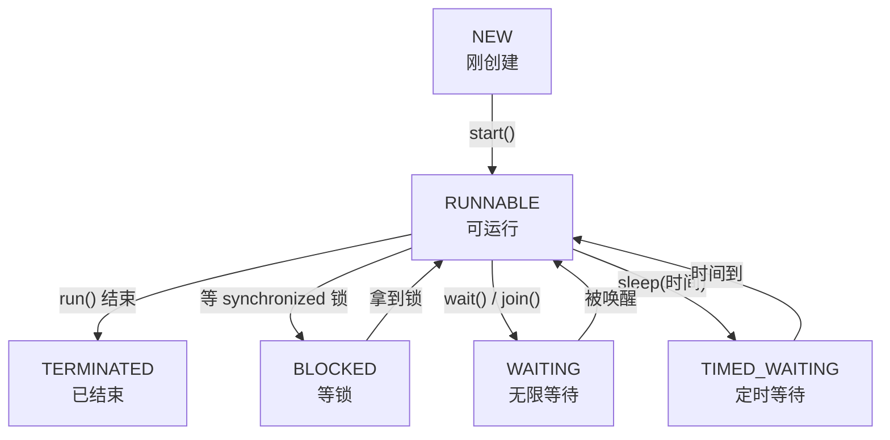

---

# 线程安全

线程安全的问题，本质都来自**多个线程共享同一份可变数据**。核心就两类问题：

- **原子性**：一段"读-改-写"操作，中途被别的线程插进来，结果出错。
- **可见性**：一个线程改了变量，别的线程没及时看到，读到旧值。

下面四个 demo 分别对应这两类问题和它们的解法。

## 1. 竞态条件（unsafeTicketSale）—— 问题长什么样

两个售票窗口线程操作**同一个** `office` 对象、同一个 `remainingTickets` 字段：

```java
boolean sellOne() {
    if (remainingTickets <= 0) return false;   // ① 检查
    int ticketNumber = remainingTickets;
    if (!sleepSafely(30)) return false;         // ② 放大镜：放大竞态窗口
    remainingTickets = ticketNumber - 1;        // ③ 修改
    log("售出 " + ticketNumber + " 号票，剩余 " + remainingTickets);
    return true;
}
```

**问题根源**：①检查 和 ③修改 不是一个原子操作，中间隔着 ②。两个线程会交错执行。

`sleep(30)` 让两个线程几乎**齐步走**，完整时间线（R = remainingTickets，初始 6）：

| 时刻 | 窗口 A | 窗口 B | R |
|------|--------|--------|---|
| t1 | 读 R=6，记 ticketNumber=6 | 读 R=6，记 ticketNumber=6 | 6 |
| t2 | sleep 30ms | sleep 30ms | 6 |
| t3 | 写 R=6-1=5，打印"售出6 剩余5" | 写 R=6-1=5，打印"售出6 剩余5" | 5 |
| t4 | 读 R=5 | 读 R=5 | 5 |
| t5 | sleep | sleep | 5 |
| t6 | 写 R=4，打印"售出5" | 写 R=4，打印"售出5" | 4 |
| … | … | … | … |

每一轮两个线程读到的是同一个 R，所以：

- 同一个票号被打印两次（6 6 5 5 4 4 …，这就是看到的"66 55 44"）
- 但 R 每轮只减 1（A 写 5、B 也写 5，两次写同一个值，等于只减了一次）

结果**卖了 12 次票，R 却只从 6 减到 0，实际只扣了 6 张，超卖一倍**。

**为什么正好停在 0，不会变负数**，看最后一轮 R=1 时：

1. A 读 R=1，通过 `1 > 0` 检查；B 也读 R=1，也通过
2. 两个都 sleep
3. A 写 R=0，打印"售出1 剩余0"；B 写 R=0，打印"售出1 剩余0"
4. 下一次循环，`R=0`，`0 <= 0` → 返回 false，两个线程都退出

**为什么这次这么整齐**：`sleep(30)` 相对其他几行代码（几纳秒）太长了，几乎每次都把两个线程对齐到同一节奏——一起读、一起睡、一起写，所以现象很规律。去掉 sleep 或改小，会看到更混乱的结果（偶尔重复、跳号、甚至负数），但本质都是同一个 bug：读-改-写不是原子的。

> `sleep(30)` 不是业务需要，是教学"放大镜"。真实代码没有它，bug 照样存在，只是更难复现——这正是并发 bug 最坑的地方。

## 2. synchronized（synchronizedTicketSale）—— 解决原子性

跟 unsafe 版唯一区别：方法签名加了 `synchronized`。

```java
synchronized boolean sellOne() { ... }   // 只多了这一个关键字
```

**做了什么**：给整个方法体套一把锁，锁的是**当前对象**（`office` 实例）。同一时刻只有一个线程能进入方法，其他线程在门外排队。

**为什么修好了**：

1. 窗口 A 拿到锁，进入 `sellOne`
2. 窗口 B 想进，发现锁被占 → 进入 **BLOCKED（等锁）** 状态排队
3. A 完整跑完"检查→sleep→修改→打印"，中途不会被插入，然后释放锁
4. B 才拿到锁进来，读到的是 A 更新后的最新值

于是"读-改-写"变成**不可分割的一整块**（原子性），票号规矩地 6 5 4 3 2 1，每张只卖一次。

**要点**：
- 锁保护的是"进入方法的资格"，逼线程串行执行
- `synchronized` 顺带保证可见性（释放锁时刷新到主内存），所以 `remainingTickets` 不用再加 volatile
- 代价：并发变串行，慢了但对了

## 3. volatile（volatileStopFlag）—— 解决可见性

这是**另一类问题**，跟原子性无关。

```java
private volatile boolean running = true;

public void run() {
    while (running && !Thread.currentThread().isInterrupted()) {
        log("正在同步第 " + batch++ + " 批数据");
        sleepSafely(100);
    }
    log("读取到停止信号，结束同步");
}

void stop() { running = false; }   // 主线程改这个开关
```

**为什么需要 volatile**：每个线程为了快，可能把 `running` 缓存到自己的工作内存，不是每次都读主内存。如果不加 volatile：

- 主线程把主内存里的 `running` 改成 false
- 后台线程一直读自己缓存里的旧值 true，**永远看不到改动** → 死循环停不下来

加 volatile 后规则变成：写 → 立刻刷回主内存；读 → 必须从主内存重读。于是主线程一改，后台线程下一轮循环立刻看到 false，正常退出。

**要点**：
- volatile **只保证可见性，不保证原子性**
- 典型场景：一写多读的**状态开关 / 停止标志**

## 4. AtomicInteger（atomicDownloadCount）—— CAS 无锁原子自增

三个下载线程给共享计数器加 1：

```java
AtomicInteger completedCount = new AtomicInteger();
...
int count = completedCount.incrementAndGet();   // 原子自增，返回自增后的值
```

**为什么 count++ 不安全，加 volatile 也不行**：`count++` 实际是三步——读→加1→写回，又是"读-改-写"。假设当前是 2：

- X 读到 2，Y 也读到 2
- 两个都算出 3，都写回 3
- 结果两次自增只涨了 1，最终数量少了

volatile 只保证读到最新值，管不了"读完到写回之间被插入"，所以救不了。

**AtomicInteger 怎么修好的：CAS（Compare-And-Swap）**，一条 CPU 级原子指令：

> "我以为现在是 2，如果真的还是 2，就改成 3；如果不是（被别人改过），就重读、重算、再试一次。"

不断循环重试直到成功，整个"比较+交换"由 CPU 保证不可分割，不用加锁也不丢更新。

## 5. ReentrantLock（lockedBankWithdraw）—— 手动加锁

```java
class BankAccount {
    private final ReentrantLock lock = new ReentrantLock();   // 一把可重入锁
    private int balance = 100;

    void withdraw(int amount) {
        lock.lock();          // 上锁
        try {
            log("检查余额，当前余额=" + balance);
            if (balance >= amount) {            // ① 检查
                if (!sleepSafely(100)) return;  // ② 放大镜
                balance -= amount;              // ③ 修改
                log("取款成功，剩余余额=" + balance);
            } else {
                log("余额不足，取款失败");
            }
        } finally {
            lock.unlock();    // 解锁，必须放 finally
        }
    }
}
```

场景：余额 100 的**同一个账户**，A、B 两个人同时各取 80。

**这本质还是卖票那个 bug**：`withdraw` 里又是"①检查余额 → ②sleep → ③扣钱"的读-改-写。如果不加锁：

1. A 读 balance=100，看到 `100 >= 80`，通过；B 读 balance=100，也通过
2. 两个都 sleep
3. A 扣钱：balance = 100 - 80 = 20
4. B 扣钱：balance = 20 - 80 = **-60**

结果一个 100 元的账户被取走 160，余额变负数（超额取款）。跟卖票超卖是同一类问题。

**ReentrantLock 怎么修好的**：它是一把**手动锁**——自己调 `lock()` 上锁、`unlock()` 解锁。加锁后：

1. A 调 `lock.lock()` 拿到锁，进入方法
2. B 调 `lock.lock()` 时发现锁被占，**阻塞等待**（排队）
3. A 完整跑完"检查→sleep→扣钱→打印"，然后 `unlock()` 释放锁
4. B 才拿到锁进来，此时读到 balance=20，`20 >= 80` 不成立 → 打印"余额不足，取款失败"

于是只有一个人取款成功，另一个被正确拒绝，余额不会变负。

**三个必须记住的写法**：

- **`unlock()` 一定要放在 `finally` 里**。否则 try 中间抛异常时锁永远不释放，其他线程永远卡死（死锁）。而 `synchronized` 会在退出代码块时自动释放，不用操心。
- **`lock()` 要放在 `try` 之前**，不要放进 try 里。否则万一 lock 本身失败，finally 里的 unlock 会去解一把没拿到的锁而报错。
- **`lock` 字段用 `final`**，保证两个线程用的是同一把锁——锁错对象等于没锁。

**ReentrantLock vs synchronized**：同样是互斥锁，解决同样的原子性问题，区别在灵活性。

| | synchronized | ReentrantLock |
|---|---|---|
| 加解锁 | 自动（进出代码块） | 手动 `lock()` / `unlock()` |
| 忘记释放 | 不会（自动） | 会（必须自己写 finally） |
| 能否响应中断 | 不能 | 能（`lockInterruptibly()`） |
| 能否设超时 | 不能 | 能（`tryLock(时间)`，拿不到就放弃） |
| 能否公平排队 | 不能（非公平） | 能（构造时传 true） |
| 能否多个条件等待 | 只有一个 wait 队列 | 能（多个 `Condition`） |

一句话：**`synchronized` 够用、省心、不会忘记释放，优先用它；只有当你需要"可中断、可超时、公平锁、多条件"这些高级能力时，才上 `ReentrantLock`。**

**"可重入"含义**：指**同一个线程**可以对它已经持有的锁再次 `lock()`（计数加 1），只要对应次数的 `unlock()` 就行。这样一个加了锁的方法里再调用另一个加同一把锁的方法，不会把自己锁死。`synchronized` 也是可重入的。

## 6. wait / notify（waitForMeal）—— 线程协作

前面几个 demo 是"抢同一份数据"，这个是"一个线程等另一个线程"。

```java
Object mealLock = new Object();      // 协作用的锁对象
boolean[] mealReady = {false};        // 状态：餐好了没

// 外卖员线程：等餐
Thread courierThread = new Thread(() -> {
    synchronized (mealLock) {                  // 先拿到锁
        while (!mealReady[0]) {                 // 用 while 检查条件
            try {
                log("餐还没做好，外卖员调用 wait() 等待");
                mealLock.wait();                // 等待：释放锁 + 挂起
            } catch (InterruptedException e) {
                Thread.currentThread().interrupt();
                log("外卖员取消等待");
                return;
            }
        }
        log("外卖员收到通知，取餐离开");
    }
}, "courierThread");

// 商家线程：出餐后通知
Thread restaurantThread = new Thread(() -> {
    if (!sleepSafely(400)) return;             // 做饭 400ms
    synchronized (mealLock) {                  // 拿到同一把锁
        mealReady[0] = true;                    // 改状态
        log("商家出餐，调用 notifyAll()");
        mealLock.notifyAll();                   // 唤醒等待的线程
    }
}, "restaurantThread");
```

场景：外卖员先到店，餐还没好，他等着；商家做好后喊一声，外卖员取餐走人。

**完整时间线**：

1. 外卖员线程启动，进入 `synchronized(mealLock)`，**持有锁**
2. 检查 `mealReady[0]` 是 false → 进入 while，调用 `mealLock.wait()`
3. `wait()` 做两件事：**释放锁** + 把自己挂起进入 WAITING 状态
4. 商家线程 sleep 400ms 后，因为锁已被外卖员释放，能顺利进入 `synchronized(mealLock)`
5. 商家把 `mealReady[0]` 改成 true，调用 `notifyAll()` 唤醒外卖员
6. 外卖员**此刻还不能马上走**，因为商家还占着锁；要等商家退出 synchronized 块、释放锁
7. 外卖员重新拿到锁，`wait()` 返回，再次检查 while 条件——这次 `mealReady[0]` 是 true → 退出循环
8. 打印"收到通知，取餐离开"，退出 synchronized 块

**三个关键点（wait/notify 最容易错的地方）**：

- **必须在 `synchronized` 块里调用 `wait()` / `notify()`**，而且是同一把锁对象。否则抛 `IllegalMonitorStateException`。因为 wait/notify 操作的就是这把锁的"等待队列"。
- **`wait()` 会释放锁，`sleep()` 不会**。这是两者本质区别：
  - `wait()`：我先让出锁，商家才进得来改状态、通知我
  - `sleep()`：抱着锁睡，别人进不来——如果这里用 sleep，商家永远拿不到锁，死锁
- **一定要用 `while` 判断条件，不能用 `if`**，原因有两个：
  1. **虚假唤醒**：线程可能没被 notify 也莫名醒来，while 会重新检查条件、不满足就继续 wait；if 就直接往下走了，出错
  2. **状态被抢**：notifyAll 唤醒多个线程时，只有一个能满足条件，其他被唤醒后 while 重新检查发现条件没满足，会继续等

**mealReady 这个标志为什么不能省**：它防的是"**通知早于等待**"的丢信号问题。万一商家先出餐、先 `notifyAll()`，外卖员才姗姗来迟调 `wait()`——那个通知已经发过了，外卖员会**永远等下去**。有了 `mealReady` 标志（在持有锁的情况下检查）：外卖员进来先看 `while(!mealReady[0])`，发现餐已经好了，压根不进入 wait，直接取餐走人。所以 **"状态标志 + while 检查"是 wait/notify 的标准配套**，缺一不可。

**notify vs notifyAll**：

- `notify()`：只随机唤醒**一个**等待线程
- `notifyAll()`：唤醒**所有**等待线程，让它们各自去抢锁、重新检查条件
- 一般推荐 `notifyAll()` 更安全，避免"唤醒了一个不满足条件的线程、真正该醒的还在睡"

一句话：**wait/notify 是线程间"约好了叫我"的机制——等的一方在 synchronized 里 while 检查条件、不满足就 wait（并让出锁）；通知的一方改完状态后 notify。核心三件套：同一把锁 + 状态标志 + while 循环。**

## 对比总结

**synchronized vs volatile**

| | synchronized | volatile |
|---|---|---|
| 解决的问题 | 原子性（+ 可见性） | 只有可见性 |
| 典型场景 | 多线程读写同一数据（卖票、转账、计数） | 一写多读的状态开关 |
| 代价 | 加锁、排队、变串行 | 很轻，几乎无阻塞 |
| 替代关系 | 能顶 volatile 的活，但重 | 顶不了 synchronized（无原子性） |

**悲观锁 vs CAS（乐观锁）**

| | synchronized / Lock | AtomicInteger（CAS） |
|---|---|---|
| 思路 | 悲观锁：先加锁，别人别进来 | 乐观锁：先干，冲突了就重试 |
| 阻塞 | 会（线程 BLOCKED 排队） | 不会（自旋重试） |
| 适用 | 一段复杂的复合操作 | 单个变量的原子读改写 |
| 性能 | 竞争激烈时开销大 | 单变量场景更轻快 |

## **一句话记忆**：
- 要保证一段操作不被打断（锁一段方法实际锁的是这个对象） → `synchronized`
- 要保证一个值的改动马上被看见（线程running 标记位） → `volatile`
- 要对单个变量做原子自增/更新（++ --改动 CPU级别优化） → `AtomicInteger`
- 需要可中断/可超时/公平/多条件的锁 → `ReentrantLock`
- 一个线程要等另一个线程满足条件 → `wait` / `notify`（同一把锁 + 状态标志 + while）

---

# 并发工具

线程安全解决的是"多线程抢数据怎么不出错"；并发工具解决的是"怎么协调一组任务"——等待、拿结果、复用线程。

## 1. CountDownLatch（loadHomePage）—— 等一组任务全部完成

专门解决"等一批任务都干完再继续"。

```java
CountDownLatch allApiFinished = new CountDownLatch(3);   // 计数器 = 3

startApiRequest("用户接口", 200, allApiFinished);
startApiRequest("广告接口", 350, allApiFinished);
startApiRequest("推荐接口", 500, allApiFinished);

Thread homeRenderThread = new Thread(() -> {
    try {
        log("等待三个接口完成，调用 CountDownLatch.await()");
        allApiFinished.await();          // 阻塞，直到计数器归 0
        log("三个接口均完成，开始渲染首页");
    } catch (InterruptedException e) {
        Thread.currentThread().interrupt();
        log("首页等待被取消");
    }
}, "homeRenderThread");
```

每个接口线程：

```java
Thread apiThread = new Thread(() -> {
    try {
        log(apiName + "开始请求");
        Thread.sleep(durationMillis);
        log(apiName + "请求完成");
    } catch (InterruptedException e) {
        Thread.currentThread().interrupt();
    } finally {
        latch.countDown();               // 无论成功失败，计数器减 1
    }
}, apiName);
```

场景：首页要等用户、广告、推荐三个接口都返回了才渲染。

**工作原理：一个只减不增的计数器**

- `new CountDownLatch(3)`：计数器初始化为 3
- 每个接口线程干完调 `countDown()`，计数器减 1
- `homeRenderThread` 调 `await()` 会阻塞，**直到计数器变成 0** 才往下走

时间线：

1. 计数器 = 3，三个接口线程启动，homeRenderThread 卡在 `await()`
2. 200ms 后用户接口完成 → `countDown()` → 计数器 = 2
3. 350ms 后广告接口完成 → `countDown()` → 计数器 = 1
4. 500ms 后推荐接口完成 → `countDown()` → 计数器 = 0
5. 计数器归 0，`await()` 立刻返回 → 开始渲染首页

**两个设计要点**：

- **`countDown()` 放在 `finally` 里**：这样接口就算请求失败、被中断，也一定会减 1。否则某个接口挂了不减，计数器永远到不了 0，`await()` 就永远等下去了——跟 unlock 放 finally 同一个道理。
- **`await()` 跑在 `homeRenderThread`，不是主线程**：这个 demo 刻意把所有阻塞等待放到业务线程，不卡 Android 主线程。真实开发里不会让主线程 `await()`。

**CountDownLatch vs join()**：两个都能"等别人干完"，区别在解耦程度：

- `join()`：必须**拿到那几个 Thread 对象**，一个个 `join`。等待方和被等的线程强绑定。
- `CountDownLatch`：等待方只认**计数器**，不需要知道是谁在 `countDown()`。谁减都行、线程池里的任务减也行，计数值还能和线程数不一样（比如等 3 个逻辑事件，但由 2 个线程触发）。更灵活、更解耦。

**一次性特点**：CountDownLatch 计数器减到 0 就报废了，不能重置。需要"反复等待、循环使用"是 `CyclicBarrier` 的活。

一句话：**CountDownLatch = 一个只减不增的计数器，`await()` 等它归 0，用来"等一组任务全部完成"；countDown 记得放 finally。**

## 2. Callable / Future（calculateOrderPrice）—— 后台算完把结果拿回来

`CountDownLatch` 只能等任务"干完了"，但拿不到结果。`Future` 更进一步：**既等它干完，又把返回值拿回来**。

```java
Thread orderPriceThread = new Thread(() -> {
    ExecutorService priceExecutor = Executors.newSingleThreadExecutor(
            r -> new Thread(r, "priceCalculatorThread"));
    activeExecutors.add(priceExecutor);
    try {
        Callable<Integer> calculatePrice = () -> {      // 有返回值的任务
            log("开始计算：商品 80 + 运费 10 - 优惠 20");
            Thread.sleep(300);
            return 80 + 10 - 20;                        // 返回 70
        };

        Future<Integer> priceFuture = priceExecutor.submit(calculatePrice);  // 提交，拿到凭证
        log("orderPriceThread 调用 Future.get() 等待价格");
        int finalPrice = priceFuture.get();             // 阻塞等结果
        log("订单最终价格=" + finalPrice);
    } catch (InterruptedException e) {
        Thread.currentThread().interrupt();
        log("订单价格计算被取消");
    } catch (Exception e) {
        log("订单价格计算失败：" + e.getMessage());
    } finally {
        priceExecutor.shutdownNow();                    // 用完关掉线程池
        activeExecutors.remove(priceExecutor);
    }
}, "orderPriceThread");
```

场景：后台线程算订单总价（商品 80 + 运费 10 - 优惠 20 = 70），算完把结果拿回来打印。

**三个新角色**：

- **`Callable<V>`**：和 `Runnable` 一样是"一个任务"，但有两点不同：
  1. 它**有返回值**（`Runnable` 的 `run()` 返回 void，`Callable` 的 `call()` 返回一个值）
  2. 它**允许抛出受检异常**（Runnable 不行）
- **`Future<V>`**：提交 Callable 后立刻拿到的一张"**取货凭证**"。任务还在后台跑，凭证先给你，等结果好了凭它取。
- **`ExecutorService.submit()`**：把 Callable 交给线程池执行，返回那张 Future 凭证。

**工作流程**：

1. `orderPriceThread` 创建一个单线程池，提交 `calculatePrice` 这个 Callable
2. `submit()` 立刻返回 `priceFuture`（此时任务在 `priceCalculatorThread` 上才刚开始算）
3. `orderPriceThread` 调 `priceFuture.get()` → **阻塞**，等结果
4. `priceCalculatorThread` sleep 300ms 后算出 70，任务结束
5. `get()` 拿到 70 返回，打印"订单最终价格=70"

**几个要点**：

- **`get()` 是阻塞的**：调用它的线程会停在这里等，直到结果算好。所以这里也刻意放在 `orderPriceThread`，不卡主线程。
- **`get()` 能把后台的异常带回来**：如果 Callable 里抛了异常，`get()` 会抛出 `ExecutionException`，把原始异常包在里面。这样后台任务的错误不会悄悄丢失，能在主流程里被 catch 到——这是它比"自己开线程 + 共享变量传结果"强的地方。
- **`get(timeout)` 可以设超时**：等太久就放弃，不会无限等。
- **线程池用完要 `shutdown`**：放在 finally 里，避免线程泄漏。

**和前面的对比**：

| 工具 | 能力 |
|------|------|
| `join()` | 等一个线程结束，**拿不到返回值** |
| `CountDownLatch` | 等一组任务结束，**拿不到返回值** |
| `Future` | 等一个任务结束，**能拿到返回值 + 能带回异常** |

一句话：**`Callable` 是有返回值的任务，`submit()` 后拿到 `Future` 凭证，`Future.get()` 阻塞等结果并把返回值（或异常）带回来。** 这套正好对标 Kotlin 协程的 `async { } + await()`。

---

# 线程池

## ThreadPoolExecutor（uploadImages）—— 批量上传六张图片

```java
CountDownLatch uploadsFinished = new CountDownLatch(6);
AtomicInteger threadNumber = new AtomicInteger();
ThreadPoolExecutor uploadPool = new ThreadPoolExecutor(
        2,                              // ① 核心线程数 corePoolSize
        3,                              // ② 最大线程数 maximumPoolSize
        5, TimeUnit.SECONDS,            // ③ 非核心线程空闲存活时间
        new ArrayBlockingQueue<>(2),    // ④ 等待队列，容量 2
        r -> new Thread(r, "upload-" + threadNumber.incrementAndGet()),  // ⑤ 线程工厂
        (r, executor) -> {              // ⑥ 拒绝策略
            log("线程和队列都满了，第六张图片由 uploadResultThread 上传");
            r.run();
        });

for (int i = 1; i <= 6; i++) {
    int imageNumber = i;
    uploadPool.execute(() -> {
        try {
            log("开始上传图片 " + imageNumber);
            Thread.sleep(250);
            log("图片 " + imageNumber + " 上传完成");
        } finally {
            uploadsFinished.countDown();
        }
    });
}
uploadsFinished.await();     // 等六张都传完
```

## 为什么要线程池

每来一个任务就 `new Thread` 有两个问题：创建/销毁线程开销大；任务一多，线程数失控，内存爆掉。线程池的思路是：**养一批线程反复复用**，并且**控制同时干活的线程数量**。

## 六个构造参数

| 参数 | 含义 |
|------|------|
| ① corePoolSize=2 | 核心线程数，常驻的"正式工" |
| ② maximumPoolSize=3 | 最大线程数，忙不过来时最多能扩到几个 |
| ③ keepAliveTime=5s | 非核心线程（"临时工"）空闲超过这个时间就被回收 |
| ④ workQueue（容量2） | 核心线程都忙时，任务先在这里排队 |
| ⑤ threadFactory | 怎么创建线程（这里用来给线程起名 upload-1/2/3） |
| ⑥ 拒绝策略 | 线程和队列都满了，新任务怎么办 |

## 核心中的核心：任务来了怎么安排（顺序千万别记错）

这是线程池最容易搞混的地方。来一个任务，按**这个顺序**判断：

1. 当前线程数 < 核心数？→ **新建一个核心线程**来干
2. 否则，队列没满？→ **放进队列**排队
3. 否则，当前线程数 < 最大数？→ **新建一个临时线程**来干
4. 否则 → **执行拒绝策略**

> ⚠️ 最常见的误解是以为"先把线程加到最大，再排队"。**错**，实际是**先加到核心 → 再排队 → 队列满了才加到最大 → 最后才拒绝**。队列排在扩线程前面。

## 用这个配置（核心2、最大3、队列2）走一遍 6 张图片

6 个任务几乎同时提交（循环很快，上传要 250ms 还没完成）：

1. **图片1**：线程数 0 < 核心 2 → 新建 upload-1，开传
2. **图片2**：线程数 1 < 核心 2 → 新建 upload-2，开传
3. **图片3**：核心满(2)，队列没满 → 进队列，queue=[3]
4. **图片4**：队列还没满 → 进队列，queue=[3,4]，队列满了
5. **图片5**：核心满、队列满(2/2)，线程数 2 < 最大 3 → 新建临时线程 upload-3，开传
6. **图片6**：核心满、队列满、线程数 3 = 最大 → **触发拒绝策略** → 由 `uploadResultThread` 自己 `r.run()` 上传

所以：upload-1 传图1、upload-2 传图2、upload-3 传图5，图3和图4在队列里等核心线程空出来再传，图6被"退回"给提交它的线程自己传。

## 拒绝策略（第 6 个参数）

线程和队列都满了，JDK 内置 4 种处理方式：

- **AbortPolicy**（默认）：直接抛异常 `RejectedExecutionException`
- **CallerRunsPolicy**：谁提交的谁自己跑——本 demo 手写的 `r.run()` 就是这个思路
- **DiscardPolicy**：默默丢弃新任务
- **DiscardOldestPolicy**：丢掉队列里最老的，腾位置给新的

这个 demo 用 CallerRuns 的效果：图6不会丢、也不报错，而是让 `uploadResultThread` 亲自上传，相当于"忙不过来就让下单的人自己去搬"，天然起到降速削峰的作用。

## 几个补充要点

- **`execute()` vs `submit()`**：execute 没返回值（接收 Runnable）；submit 返回 Future（可接收 Callable，能拿结果）。要结果用 submit，就是上一节讲的。
- **`Executors` 的快捷工厂别乱用**：`newFixedThreadPool` / `newCachedThreadPool` 底层队列是无界的（`LinkedBlockingQueue` 不限长），任务堆积会 OOM。阿里规范建议**手动 new ThreadPoolExecutor**，参数自己把控——这个 demo 就是手动配的。
- **`shutdown()` vs `shutdownNow()`**：shutdown 平缓关闭（不收新任务，等已有的跑完）；shutdownNow 强制关闭（中断正在跑的、返回没执行的）。用完一定要关，放 finally。

一句话：**线程池 = 复用线程 + 控制并发量。记住任务安排顺序"核心→队列→最大→拒绝"，以及队列排在扩容前面，这一条能解决 80% 的线程池问题。**
