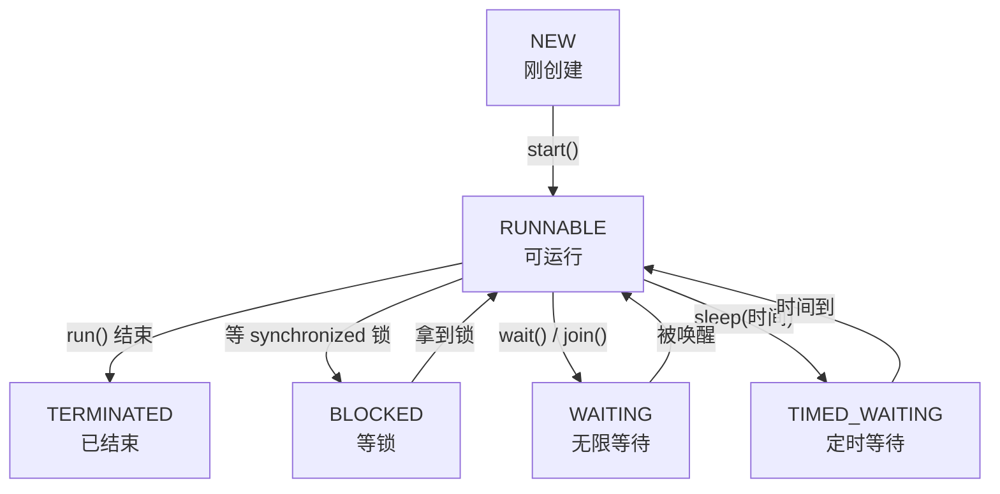

```mermaid
flowchart TB
    A["NEW<br/>刚创建"] -->|"start()"| B["RUNNABLE<br/>可运行"]

    B -->|"run() 结束"| C["TERMINATED<br/>已结束"]

    B -->|"等 synchronized 锁"| D["BLOCKED<br/>等锁"]
    B -->|"wait() / join()"| E["WAITING<br/>无限等待"]
    B -->|"sleep(时间)"| F["TIMED_WAITING<br/>定时等待"]

    D -->|"拿到锁"| B
    E -->|"被唤醒"| B
    F -->|"时间到"| B
```